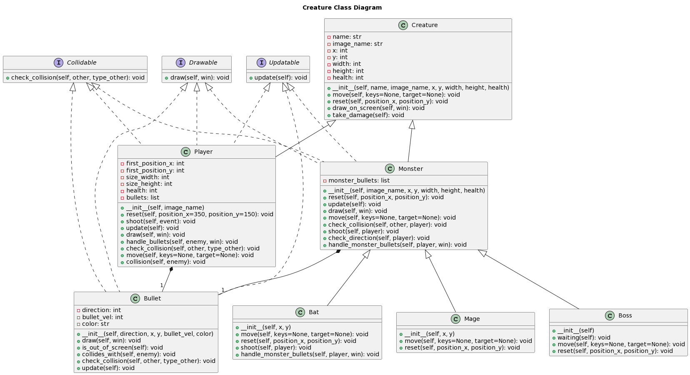
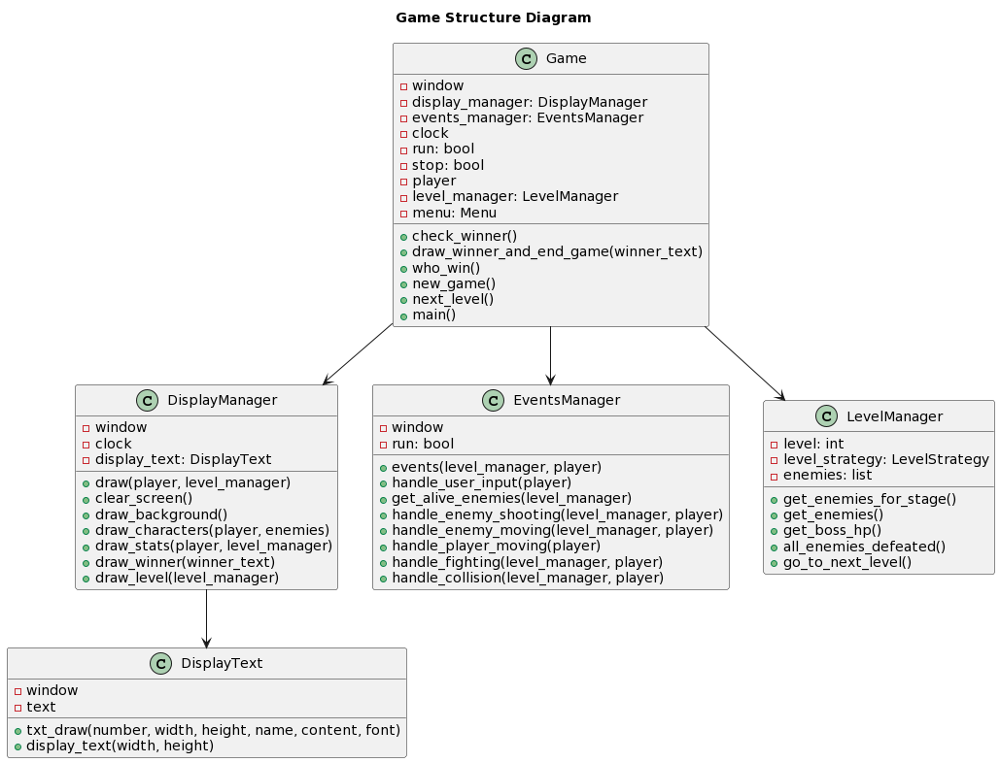
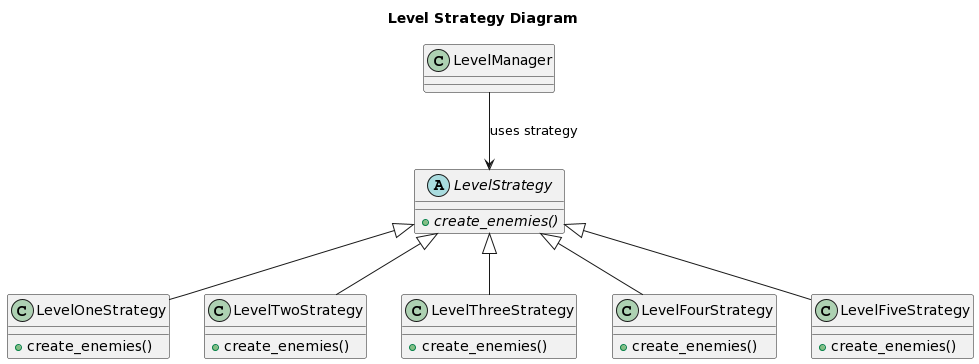
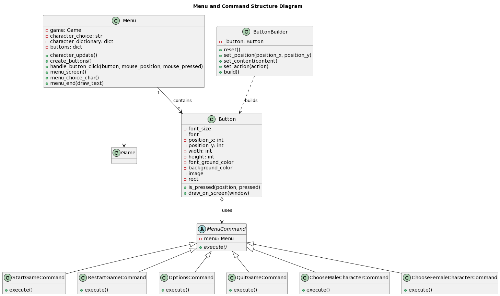

# PyGame Skill Game
The game was created as a part of a personal project aimed at developing programming skills and pursuing personal interests.

## Gameplay
Feel free to watch the gameplay on the YouTube platform ([link](https://youtu.be/P75WP1kLdeY)).

## Storyline
As a beginner adventurer, you set out on your first mission. The first location should be easy and predictable... but it won't be. You will have to fight for survival and until you defeat the wizard, you will not experience peace in this world... Are you ready for this adventure? 

## Running the Game

### Required Software
To run the game, you need to install the Python interpreter version 3.10 or higher on your system ([link](https://www.python.org/downloads/)).  Additionally, you need to install the Pygame library using the pip package manager or use the requirements.txt file.

```bash
pip install -r requirements.txt
```
([link to details](https://www.pygame.org/wiki/GettingStarted]))

### Launching
To start the game, simply run it using the Python interpreter.

```bash
python main.py
```
If you are not in the project folder, you need to provide an absolute path to the file instead of "main.py".


## Program Description
The PyGame Skill Game project is an object-oriented game written in Python. It utilizes the Pygame library for graphical rendering and interaction. The game features various classes that represent different entities and behaviors within the game world. These classes have been designed with an object-oriented approach to provide modularity, maintainability, and code reusability.

The Creature class serves as the base class for all characters in the game, including monsters and the player. Each character type inherits from the Creature class and implements specific logic for moving, interacting, and drawing on the screen. For instance, the Player, Monster, and Bullet classes implement interfaces such as Drawable, Collidable, and Updatable to handle drawing, collision detection, and state updates.

The LevelManager class manages the progression of levels, generating enemies based on different strategies. It ensures that the game becomes progressively challenging as the player advances through the stages.

Additionally, the game includes a Menu class with buttons for starting the game, selecting characters, and managing game options. The menu provides a user-friendly interface to navigate the game's functionalities.

While the project already demonstrates good use of object-oriented principles, there is room for further improvement. Refactoring the code to adhere to SOLID principles and design patterns can enhance maintainability and extensibility. 

## Unit Testing
Comprehensive unit testing is an integral part of this project. A total of 88 unit tests have been meticulously written to ensure the correctness and reliability of the codebase. These tests cover various aspects of the game's functionality, including character behavior, collision detection, stage progression, shooting mechanics, and more. 

To run the tests, execute the following command in the project's root directory:
```bash
pytest
```

After running the unit tests, a pytest report has been generated in HTML format. You can view the test results and other metrics, such as code coverage, by opening the [pytest report](./tests/report.html).

## Diagrams

Diagrams have been prepared in PlantUML format to illustrate the project's architecture and structure. These visual representations help in understanding the relationships between different classes and their interactions. Click on the thumbnail below to view the full-size diagram or access the corresponding PlantUML file.

<div></div>
<div></div>
<div></div>
<div></div>


Click on the thumbnail to view the full-size diagram, or click the link to open the PlantUML file in `.puml` format.

## Using Pylint for Code Analysis
Pylint is a powerful static code analysis tool that can help identify potential issues and enforce coding standards.

```bash
pylint --rcfile .pylintrc your_file.py
```
Replace your_file.py with the actual name of your Python file. This command will run pylint with the provided configuration file, enabling you to analyze your code and receive feedback on potential issues and improvements.

# Author
Marek Drąg
